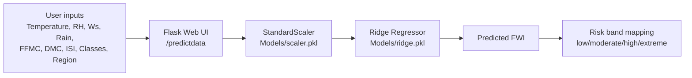

<div align="center">

# Predict-Forest-Fire

**Algerian Forest Fires (2012) — Fire Weather Index (FWI) prediction with a modern Flask UI**

[](#)
[](#)
[](#)

</div>

<p align="center">
  
</p>

<p align="center">
  
</p>

<p align="center">
  
</p>

An end-to-end forest-fire prediction project using the Algerian Forest Fires dataset. This repository contains:

- **ML (training + inference)** notebooks and exported artifacts
- **Flask web app** for predicting **FWI** from weather + FWI components and showing a **risk band**
- **Docs assets** (screenshots + plots) for showcasing results

## Table of Contents

- Demo
- Features
- Dataset
- Repository layout
- Quick start
- How it works
- Model training
- Training graphs
- Credits

## Features

- **FWI prediction** using a saved `scikit-learn` model (`Models/ridge.pkl`) and standardized inputs (`Models/scaler.pkl`).
- **Modern UI** with form UX and immediate feedback (client-side input range validation).
- **Risk band output** (low/moderate/high/extreme) derived from predicted FWI.
- Notebooks for EDA + model training.

## Demo

- **Landing screen**

  

- **Prediction form**

  

- **Prediction output**

  

## Dataset — Algerian Forest Fires

Short summary:

- Instances: 244 (122 per region: Bejaia and Sidi Bel-abbes)
- Period: June — September 2012
- Inputs: 11 attributes (weather + FWI components)
- Output: `Classes` — two labels (`fire`, `not fire`) — 138 fire, 106 not fire

Attribute list:

1. Date — DD/MM/YYYY
2. Temp — temperature at noon (°C)
3. RH — relative humidity (%)
4. Ws — wind speed (km/h)
5. Rain — daily rainfall (mm)
6. FFMC — Fine Fuel Moisture Code
7. DMC — Duff Moisture Code
8. DC — Drought Code
9. ISI — Initial Spread Index
10. BUI — Buildup Index
11. FWI — Fire Weather Index
12. Classes — `fire` / `not fire`

CSV files are stored in the `Datasets/` folder.

## Repository layout

- `application.py` — Flask app entrypoint (prototype UI + endpoints).
- `Datasets/` — raw CSV data.
- `Notebooks/` — `EDA_and_FeatueEngineering.ipynb`, `model_training.ipynb`.
- `Models/` — exported scaler + trained model pickles (`ridge.pkl`, `scaler.pkl`).
- `templates/` — `home.html`, `index.html` for the Flask UI.
- `docs/` — UI screenshots + plots used in this README.
- `requirement.txt` — runtime dependencies.

## Quick start

1. Create and activate a virtual environment, then install dependencies:

```powershell
python -m venv .venv
.\.venv\Scripts\Activate.ps1
pip install -r requirement.txt
```

2. Run the Flask app locally:

```powershell
python application.py
```

Open http://localhost:5000 to use the web UI.

## How it works



## Model training

- EDA + feature engineering: `Notebooks/EDA_and_FeatueEngineering.ipynb`
- Model training: `Notebooks/model_training.ipynb`
- Exported artifacts used by the app:
  - `Models/scaler.pkl`
  - `Models/ridge.pkl`

## Training graphs


## Credits

- **Frontend/UI**: [udaycodespace](https://github.com/udaycodespace)
- **Backend + ML / Model Training**: Repository author/maintainer

